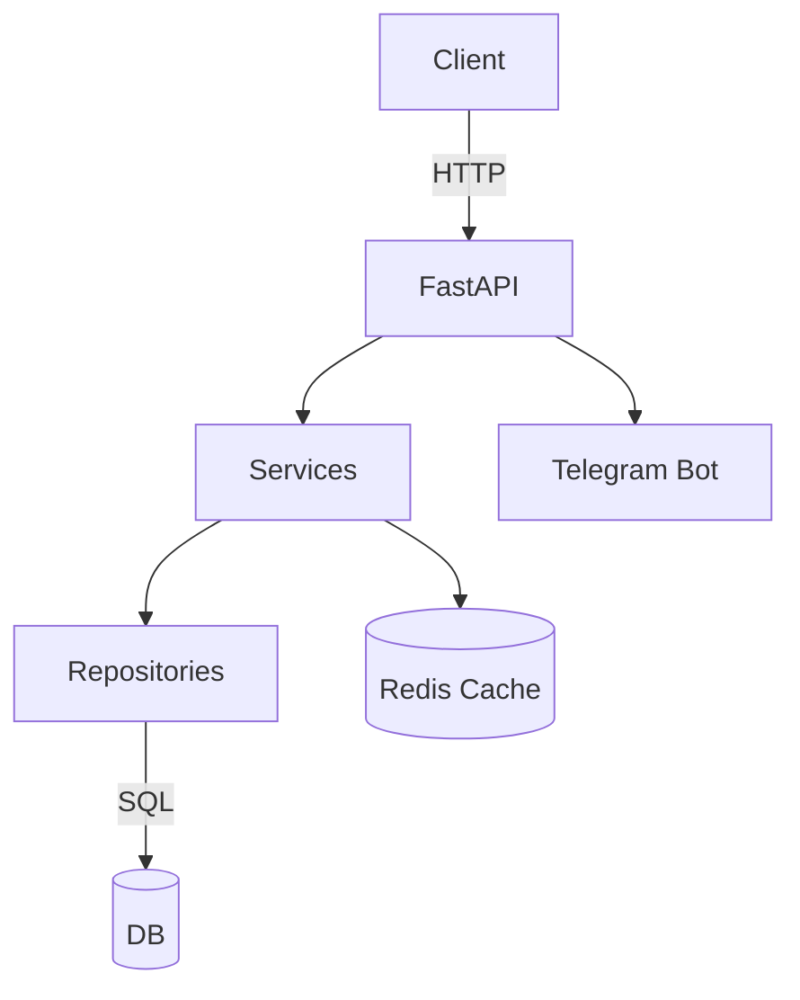

# ARCHITECTURE_UPDATED.md

Обновлённое описание архитектуры после рефакторинга Phase 1 (Architectural Stabilization).

## Context

- После выделения слоя `services/` и внедрения DI-фабрики структура приложения изменилась.  
- Архитектурные слои теперь: **API ➜ Services ➜ Repositories ➜ DB**.  
- Файл `app_factory.py` управляет жизненным циклом и зависимостями (БД, Redis, Telegram-бот).

## Changes

1. Создан пакет `services/` для бизнес-логики и DI.  
2. `main.py` теперь тонкий враппер вокруг `create_app()`.  
3. Добавлены контексты lifespan для БД, Redis и Telegram-бота.  
4. Настроен централизованный логгер и middleware трассировки.

### Новая диаграмма компонентов

## Next Steps

- Завершить миграцию настроек (`settings.py`) и удалить дубли.  
- Обновить тесты и CI-линтеры под новую структуру.  
- После Phase 2 актуализировать раздел *Security & Configs*.