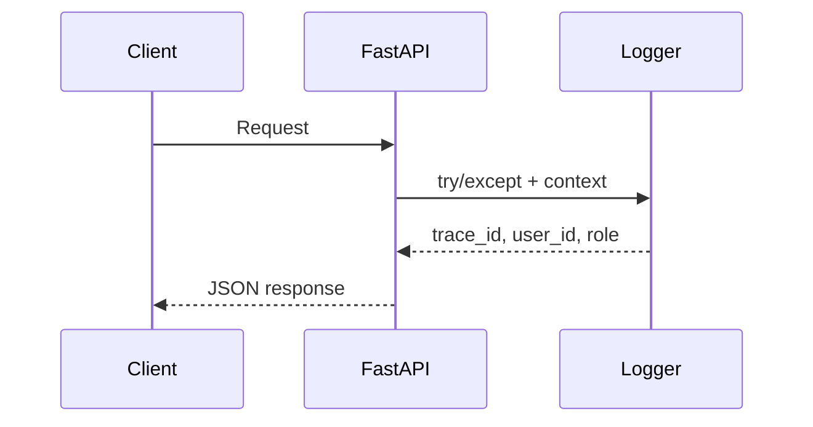

# ERROR_HANDLING_AND_LOGGING.md — Централизованная обработка ошибок и логирование

_Версия: 0.1  
Дата: 2025-05-25_

---

## 1. Middleware и обработчики исключений

В [`main.py`](../main.py) настроены:

| Тип исключения       | HTTP-код | Поведение                                                            |
|----------------------|----------|---------------------------------------------------------------------|
| `HTTPException`      | как есть | Возвращается `detail`, ошибка логируется на уровне `WARNING`         |
| `ValidationError`    | 422      | Формируется user-friendly ответ, лог `WARNING`                       |
| Необработанное       | 500      | Возвращается generic detail, логируется stacktrace `ERROR`           |



---

## 2. Структура логов

| Файл                  | Уровни          | Формат/пример                       |
|-----------------------|-----------------|-------------------------------------|
| `events.log`          | INFO/WARNING    | `2025-05-25 10:42:15 [ORDER] ...`   |
| `errors.log`          | ERROR/CRITICAL  | Stacktrace + trace_id               |

- Форматтеры задаются в [`logging_config.py`](../logging_config.py).
- Для любого входящего запроса генерируется `trace_id` (UUID4) — он прокидывается в **OpenAPI**, логи и ответ.

---

## 3. Таблица `event_logs` (PostgreSQL)

| Поле        | Тип        | Пример                   |
|-------------|-----------|--------------------------|
| `id`        | serial PK | 42                       |
| `timestamp` | timestamptz | `2025-05-25 10:42:15`   |
| `level`     | varchar   | `ERROR`                  |
| `user_id`   | int / txt | `123456789`              |
| `role`      | varchar   | `admin`                  |
| `trace_id`  | uuid      | `e34f-…`                 |
| `action`    | varchar   | `CREATE_ORDER`           |
| `endpoint`  | varchar   | `/orders/`               |
| `message`   | text      | `Validation failed …`    |

Авто-заполнение происходит через `utils/event_logger.py`.

---

## 4. API для получения логов

`routers/log_router.py`

| Метод | Путь           | Параметры фильтрации                   |
|-------|---------------|----------------------------------------|
| GET   | `/logs/`       | `trace_id`, `user_id`, `role`, `level`, `date_from`, `date_to`, `limit`, `offset` |

Пример:

```http
GET /logs/?role=admin&level=ERROR&date_from=2025-05-01T00:00:00
```

---

## 5. Telegram-уведомления

Ошибки уровня **ERROR** дублируются в Telegram-чат всех ID из `ADMIN_IDS` при помощи `aiobot/notifications.py`.

---

## 6. Будущие улучшения

| Идея                               | Приоритет |
|------------------------------------|-----------|
| Трассировка через OpenTelemetry    | P2        |
| Отправка логов в Loki / ELK stack  | P2        |
| WebSocket-стрим live-логов         | P3        |

---

_Конец файла._