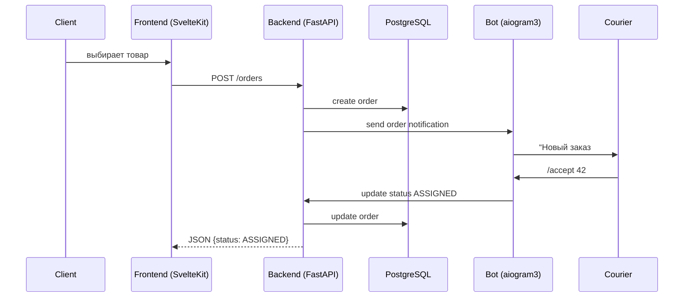

# Техническое задание: Telegram Mini App «Худжанди»

_Версия документа: 1.0  
Дата: 2025-05-25_

---

## Введение

«Худжанди» — это Telegram Mini App, предназначенное для организации онлайн-продаж готовой еды и её доставки по городу.  
Проект включает асинхронный **Backend** (FastAPI) и **Frontend** (SvelteKit 5), а также Telegram-бот на aiogram 3, который уведомляет участников цепочки: администраторов, курьеров, продавцов и клиентов.

---

## Участники системы

| Группа | Telegram-метка | Роль в процессе |
|--------|----------------|-----------------|
| **Администраторы** | _худБосс_, _худМанагер_, _худАдмин_ | Управление заказами, пользователями, курьерами, магазинами; назначение курьеров |
| **Продавцы**       | _худПрод_ | Управление своим магазином и товарами |
| **Курьеры**        | _худКур_  | Принимают заказы, сообщают статусы доставки |
| **Клиенты**        | _худПотр_ | Выбирают товары, оплачивают, оставляют отзывы |

---

## Пользовательские сценарии

### 1. Покупка и назначение курьера

1. Клиент выбирает продукты в магазине и оплачивает не покидая Mini App.  
2. В админ-панели появляется активный заказ; админ назначает доступного курьера.  
3. Курьер получает уведомление от бота и подтверждает получение заказа.

### 2. Доставка

- Курьер с помощью инлайн-команд бота отчитывается о статусах:  
  _ASSIGNED → IN_PROGRESS → DELIVERED → COMPLETED_.  
- Админ-панель показывает статусы в реальном времени.  
- При завершении доставки обе стороны могут оставить взаимную оценку и текстовый отзыв.

### 3. Реакция на негативные отзывы

- Если клиент или курьер ставит низкую оценку, бот рассылает всем активным администраторам ссылку на интерфейс отзывов.

---

## Бизнес-правила

* **Роли админов**  
  - _худБосс_ — полный доступ, включая CRUD админов.  
  - _худМанагер_ — CRUD клиентов и курьеров.  
  - _худАдмин_ — только назначение курьеров на заказы.

* **VIP-статусы и репутация** присваиваются вручную (позже — авто-пересчёт).  

* **Soft-delete** для магазинов, товаров и заказов: данные остаются в БД, но скрываются из UI.

* **История статусов заказа** хранится в отдельной таблице (audit).

---

## Структура данных (PostgreSQL)

### Заказ (Order)

- shop_id, shop_name, seller_id, courier_id, client_id  
- VIP-флаги всех участников  
- purchase_price, delivery_price  
- оценки, комментарии, даты комментариев  
- текущий статус, даты создания и обновления  

### Клиент, Курьер, Админ

Общие поля: telegram_id, name, username, photo_url, language, registered_at, reputation, VIP (для клиента/курьера).  
Дополнительно:  
- Клиент — статистика покупок, негативные отзывы.  
- Курьер — статистика доставок, доступность.  
- Админ — role, can_edit, негативные отзывы.

### Магазин и Товар

- Магазин: owner_id, name, is_vip, timestamps.  
- Товар: shop_id, name, description, price, is_available, timestamps.

---

## Требования к Backend

1. **FastAPI + SQLAlchemy 2 (async)**, Pydantic v2.  
2. Чёткая модульная структура: `routers`, `db`, `models`, `utils`.  
3. Lifespan-контекст для запуска Telegram-бота.  
4. Асинхронные CRUD-операции, DI через Depends.  
5. Логирование запросов и ошибок в таблицу `event_logs` и файл.  
6. OpenAPI/Swagger доступен по `/docs`.

---

## Требования к Telegram-боту

- Модуль `aiobot/` (bot.py, notifications.py, handlers.py).  
- Бот уведомляет о новых заказах, изменениях статуса, ошибках.  
- Конфигурация через переменные окружения (TG_TOKEN, ADMIN_IDS).  
- Возможность масштабирования (очереди / брокер сообщений в перспективе).

---

## Требования к Frontend

1. **SvelteKit 5** + TypeScript + Tailwind (по желанию).  
2. Главная страница — витрина магазинов/товаров, доступна до авторизации.  
3. При первом запуске: overlay с выбором языка (Ru, En, Tj).  
4. Авторизация происходит только при попытке оформить заказ (Telegram WebAppData).  
5. Интернационализация через Paraglide.js; файлы переводов `src/languages/*.ts`.  
6. Адаптивность под Telegram WebView, поддержка светлой / тёмной темы.  
7. Компоненты UI отделены от бизнес-логики (`lib/`).  
8. Визуальные подтверждения всех действий (toast, loader, disable-кнопка).  
9. Запрет сторонних трекеров, соответствие UX-гайдам Telegram Mini Apps.

---

## Ключевые страницы Frontend

- `/` — витрина  
- `/shops` и `/shops/[id]` — список и детали магазина  
- `/products` — все товары  
- `/orders` и `/orders/[id]` — список и детали заказов  
- `/profile` — профиль пользователя (смена языка)  
- `/auth` — авторизация через WebAppData

---

## Архитектура взаимодействия компонентов

---

## Дорожная карта релизов

| Версия | Основные фичи |
|--------|---------------|
| **v0.1** | MVP: CRUD магазинов, товаров, заказов; overlay языка; бот-уведомления |
| **v0.2** | Админ-панель, назначение курьеров, история статусов |
| **v0.3** | Система репутации и VIP, auto-assignment курьера |
| **v0.4** | Альфа продакшн-релиз, оптимизация, нагрузочное тестирование |

---

## Ограничения и будущие улучшения

- Репутация и VIP-статусы пока назначаются вручную.  
- Автоматический подбор курьера реализуется после MVP.  
- История действий администраторов может быть добавлена позднее.  
- Возможна миграция на Web-Sockets для live-обновлений статуса.

---

## Глоссарий

| Термин | Значение |
|--------|----------|
| **VIP-статус** | Привилегия для пользователей/магазинов с высокой репутацией |
| **Mini App** | Веб-приложение, встроенное в Telegram (WebApp API) |
| **WebAppData** | Способ передачи токена авторизации из Telegram в веб-страницу |
| **Soft-delete** | Логическое удаление без физического удаления из БД |

---

Конец документа.