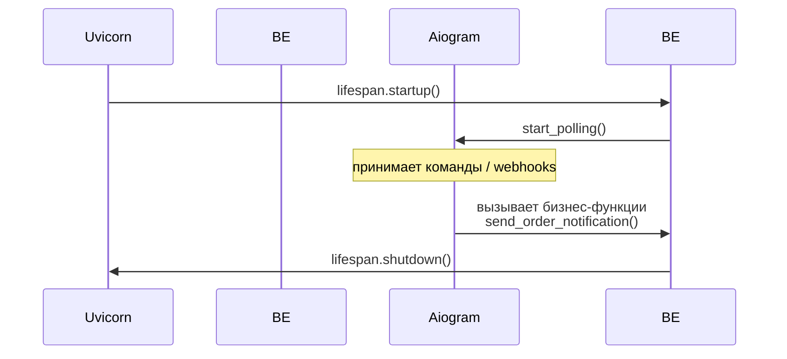

# TELEGRAM_INTEGRATION.md — Интеграция Telegram-бота и платежей

_Версия: 0.1  
Дата: 2025-05-25_

---

## 1. Переменные окружения `.env`

| Переменная         | Описание                                         | Пример                         |
|--------------------|--------------------------------------------------|--------------------------------|
| `TG_TOKEN`         | Токен Telegram-бота                              | `123456:ABC-DEF…`              |
| `ADMIN_IDS`        | Список Telegram-ID админов (через `,`)           | `123456789,987654321`          |
| `PROVIDER_TOKEN`   | Токен провайдера Telegram Payments               | `test-provider-token`          |

`.env` **добавлен в `.gitignore`**.  
Для локального запуска скопируйте шаблон и отредактируйте значения:
```bash
cp .env.example .env
```

---

## 2. Жизненный цикл бота



- **Запуск** — `dispatcher` aiogram стартует в фоне в обработчике `lifespan` FastAPI (см. [`main.py`](../main.py)).  
- **DI** — экземпляры `bot` и `dispatcher` импортируются из [`aiobot.bot`](../aiobot/bot.py).  
- **Graceful shutdown**: при остановке FastAPI вызывается `dispatcher.stop_polling()`.

---

## 3. Отправка уведомлений

Все уведомления вынесены в `aiobot/notifications.py`, чтобы не смешивать работу с Telegram и бизнес-логику.

```python
from aiobot.notifications import (
    send_order_notification,
    send_error_notification,
)
from aiobot.bot import bot

await send_order_notification(bot, chat_id, text)
await send_error_notification(bot, chat_id, error_text)
```

Рекомендуется вызывать эти функции из сервисного слоя (например, `core/services/...`).

---

## 4. Интеграция Telegram Payments

### 4.1 Добавление токена

```dotenv
PROVIDER_TOKEN=test-provider-token
```

`PROVIDER_TOKEN` загружается в `aiobot/config.py` и используется при генерации инвойса.

### 4.2 Маршрут «заглушка»

- `POST /orders/{order_id}/invoice` – генерирует инвойс и возвращает `invoice_id` + `provider_token` фронту/боту.  
- В реальной интеграции `invoice_id` будет получен через Telegram Bot API.

### 4.3 Команда `/pay` и webhook

- Команда `/pay` пока отвечает: «Платёжная интеграция в разработке…» (см. `aiobot/handlers.py`).  
- Функция `payment_webhook_stub` — пример точки входа для webhook Telegram Payments.

---

## 5. Обработка ошибок и логирование

- Все **ошибки** и **бизнес-события** логируются через `utils/event_logger.py` в файлы `events.log` и `errors.log` **и** в таблицу `event_logs`.  
- При ошибках уровня `ERROR` бот автоматически отправляет сообщение всем `ADMIN_IDS`.

---

## 6. Полезные советы

1. **Не храните токены** в коде – только в `.env` / секретах CI.  
2. Проверяйте наличие `username`. Если пользователь скрыл ник, показывайте `name` или псевдоним «Anon».  
3. Для крупных рассылок используйте `await asyncio.gather(*tasks)`, чтобы не блокировать loop.

---

## 7. Дальнейшие улучшения

| Идея                          | Приоритет |
|-------------------------------|-----------|
| Webhook-режим вместо polling  | P1        |
| Отложенные push-уведомления   | P2        |
| Поддержка Telegram Mini Apps v2 | P3        |

---

_Конец файла._